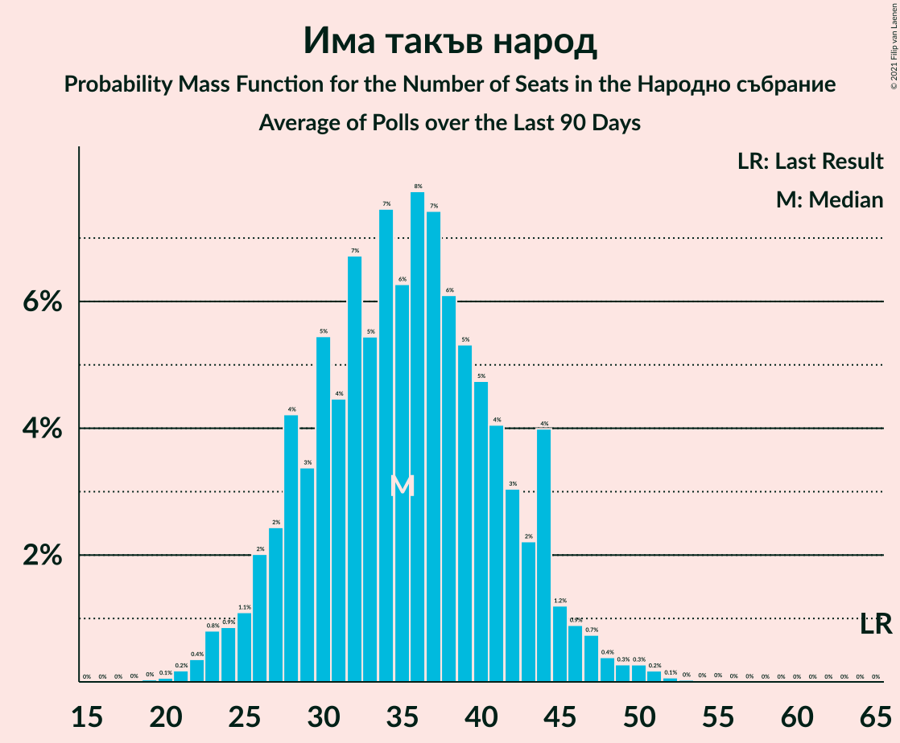

# Има такъв народ

<a href="#voting-intentions">Voting Intentions</a> | <a href="#seats">Seats</a>

## Voting Intentions

Last result: **0.0%** (General Election of 27 March 2017)

### Confidence Intervals

| Period     | Polling firm/Commissioner(s) | Median | 80% Confidence Interval | 90% Confidence Interval | 95% Confidence Interval | 99% Confidence Interval |
|:----------:|:----------------:|:-----------:|:-----------------------:|:-----------------------:|:-----------------------:|:-----------------------:|
| N/A | [Poll Average](average.html) | 15.3% | 6.2–18.7% | 5.7–19.2% | 5.3–19.7% | 4.7–20.4% |
| [6–11 November 2020](2020-11-11-БарометърБългария.html) | Барометър България | 6.1% | 5.2–7.3% | 4.9–7.6% | 4.7–7.9% | 4.3–8.5% |
| [27 October–3 November 2020](2020-11-03-SovaHarris.html) | Sova Harris | 11.4% | 10.2–12.8% | 9.9–13.2% | 9.6–13.5% | 9.0–14.2% |
| [21–27 October 2020](2020-10-27-Рего.html) | Рего | 18.6% | 17.5–19.8% | 17.2–20.1% | 16.9–20.4% | 16.4–20.9% |
| [12–16 October 2020](2020-10-16-Спектър.html) | Спектър | 16.1% | 14.7–17.7% | 14.3–18.2% | 14.0–18.5% | 13.4–19.3% |
| [10–16 October 2020](2020-10-16-БарометърБългария.html) | Барометър България | 6.1% | 5.2–7.3% | 4.9–7.6% | 4.7–7.9% | 4.3–8.5% |
| [3–10 October 2020](2020-10-10-Тренд.html) | Тренд | 15.9% | 14.5–17.4% | 14.1–17.9% | 13.7–18.3% | 13.1–19.0% |
| [1–9 October 2020](2020-10-09-GallupInternational.html) | Gallup International | 12.6% | 11.2–14.2% | 10.8–14.7% | 10.5–15.1% | 9.8–15.9% |
| [21–30 September 2020](2020-09-30-Алфарисърч.html) | Алфа рисърч | 16.6% | 15.2–18.2% | 14.8–18.6% | 14.4–19.0% | 13.8–19.8% |
| [18–26 September 2020](2020-09-26-МаркетЛИНКС.html) | Маркет ЛИНКС | 13.4% | 11.7–15.5% | 11.2–16.0% | 10.8–16.6% | 10.0–17.6% |
| [3–11 September 2020](2020-09-11-GallupInternational.html) | Gallup International | 16.3% | 14.4–18.6% | 13.8–19.2% | 13.4–19.8% | 12.5–20.9% |
| [29 August–5 September 2020](2020-09-05-Тренд.html) | Тренд   24 часа | 15.9% | 14.5–17.4% | 14.1–17.9% | 13.7–18.3% | 13.1–19.0% |
| [19–25 August 2020](2020-08-25-SovaHarris.html) | Sova Harris | 15.7% | 14.0–17.7% | 13.5–18.3% | 13.1–18.8% | 12.3–19.7% |
| [3–11 August 2020](2020-08-11-БарометърБългария.html) | Барометър България | 5.3% | 4.5–6.5% | 4.2–6.8% | 4.0–7.1% | 3.6–7.7% |
| [3–10 August 2020](2020-08-10-Тренд.html) | Тренд   24 часа | 15.4% | 14.1–17.0% | 13.7–17.4% | 13.3–17.8% | 12.7–18.6% |
| [30 July–7 August 2020](2020-08-07-GallupInternational.html) | Gallup International | 12.3% | 10.7–14.3% | 10.2–14.9% | 9.8–15.4% | 9.1–16.4% |
| [1–5 August 2020](2020-08-05-ПИК.html) | ПИК | 13.9% | 12.6–15.4% | 12.2–15.8% | 11.9–16.2% | 11.3–16.9% |
| [28 July–3 August 2020](2020-08-03-МаркетЛИНКС.html) | Маркет ЛИНКС | 23.0% | 21.0–25.1% | 20.5–25.7% | 20.0–26.2% | 19.1–27.2% |
| [23–30 July 2020](2020-07-30-Алфарисърч.html) | Алфа рисърч   Дневник | 18.8% | 16.8–21.1% | 16.3–21.8% | 15.8–22.3% | 14.9–23.4% |
| [26 June–1 July 2020](2020-07-01-SovaHarris.html) | Sova Harris | 9.1% | 7.7–10.9% | 7.3–11.3% | 7.0–11.8% | 6.4–12.7% |
| [20–25 June 2020](2020-06-25-БарометърБългария.html) | Барометър България | 3.7% | 3.0–4.7% | 2.8–5.0% | 2.7–5.3% | 2.3–5.8% |
| [27 May–3 June 2020](2020-06-03-МаркетЛИНКС.html) | Маркет ЛИНКС | 9.8% | 8.6–11.3% | 8.2–11.7% | 7.9–12.0% | 7.4–12.8% |
| [28 April–5 May 2020](2020-05-05-Алфарисърч.html) | Алфа рисърч   Дневник | 14.6% | 12.9–16.6% | 12.5–17.1% | 12.1–17.6% | 11.3–18.6% |
| [21–28 February 2020](2020-02-28-Mediana.html) | Mediana | 12.9% | 11.6–14.3% | 11.3–14.8% | 11.0–15.1% | 10.4–15.8% |
| [3–10 February 2020](2020-02-10-Тренд.html) | Тренд   24 часа | 11.4% | 9.9–13.1% | 9.5–13.6% | 9.1–14.1% | 8.5–14.9% |
| [9–13 January 2020](2020-01-13-БарометърБългария.html) | Барометър България | 3.6% | 2.9–4.5% | 2.7–4.8% | 2.5–5.0% | 2.2–5.5% |
| [5–12 December 2019](2019-12-12-Алфарисърч.html) | Алфа рисърч | 11.8% | 10.4–13.4% | 10.0–13.9% | 9.6–14.3% | 9.0–15.1% |
| [21–28 November 2019](2019-11-28-МаркетЛИНКС.html) | Маркет ЛИНКС | 13.0% | 11.4–14.9% | 10.9–15.4% | 10.5–15.9% | 9.8–16.8% |
| [7–15 November 2019](2019-11-15-Тренд.html) | Тренд | 7.9% | 6.7–9.4% | 6.3–9.8% | 6.0–10.2% | 5.5–11.0% |
| [10–16 September 2019](2019-09-16-Алфарисърч.html) | Алфа рисърч | 11.4% | 10.1–13.1% | 9.7–13.5% | 9.3–13.9% | 8.7–14.8% |
| [5–12 July 2019](2019-07-12-Тренд.html) | Тренд   24 часа | 0.0% | N/A | N/A | N/A | N/A |
| [11–19 June 2019](2019-06-19-МаркетЛИНКС.html) | Маркет ЛИНКС | 0.0% | N/A | N/A | N/A | N/A |
| [2–7 May 2019](2019-05-07-Mediana.html) | Mediana | 0.0% | N/A | N/A | N/A | N/A |
| [20–30 April 2019](2019-04-30-Алфарисърч.html) | Алфа рисърч | 0.0% | N/A | N/A | N/A | N/A |
| [12–22 April 2019](2019-04-22-МаркетЛИНКС.html) | Маркет ЛИНКС | 0.0% | N/A | N/A | N/A | N/A |
| [5–12 April 2019](2019-04-12-Тренд.html) | Тренд | 0.0% | N/A | N/A | N/A | N/A |
| [5–11 April 2019](2019-04-11-Gallup.html) | Gallup | 0.0% | N/A | N/A | N/A | N/A |
| [22–26 March 2019](2019-03-26-Алфарисърч.html) | Алфа рисърч | 0.0% | N/A | N/A | N/A | N/A |
| [6–13 March 2019](2019-03-13-Тренд.html) | Тренд | 0.0% | N/A | N/A | N/A | N/A |
| [6–11 March 2019](2019-03-11-SovaHarris.html) | Sova Harris | 0.0% | N/A | N/A | N/A | N/A |
| [19–28 February 2019](2019-02-28-Exacta.html) | Exacta | 0.0% | N/A | N/A | N/A | N/A |
| [22–28 February 2019](2019-02-28-AFIS.html) | AFIS | 0.0% | N/A | N/A | N/A | N/A |
| [15–25 February 2019](2019-02-25-МаркетЛИНКС.html) | Маркет ЛИНКС | 0.0% | N/A | N/A | N/A | N/A |
| [5–13 February 2019](2019-02-13-Тренд.html) | Тренд | 0.0% | N/A | N/A | N/A | N/A |
| [12–21 January 2019](2019-01-21-МаркетЛИНКС.html) | Маркет ЛИНКС | 0.0% | N/A | N/A | N/A | N/A |
| [19–21 January 2019](2019-01-21-SovaHarris.html) | Sova Harris | 0.0% | N/A | N/A | N/A | N/A |
| [14–19 January 2019](2019-01-19-AFIS.html) | AFIS | 0.0% | N/A | N/A | N/A | N/A |
| [14–18 December 2018](2018-12-18-Алфарисърч.html) | Алфа рисърч | 0.0% | N/A | N/A | N/A | N/A |
| [10–17 December 2018](2018-12-17-Exacta.html) | Exacta | 0.0% | N/A | N/A | N/A | N/A |
| [30 November–6 December 2018](2018-12-06-Тренд.html) | Тренд   24 часа | 0.0% | N/A | N/A | N/A | N/A |
| [16–25 November 2018](2018-11-25-МаркетЛИНКС.html) | Маркет ЛИНКС | 0.0% | N/A | N/A | N/A | N/A |
| [6–12 November 2018](2018-11-12-Тренд.html) | Тренд   24 часа | 0.0% | N/A | N/A | N/A | N/A |
| [23 June–28 October 2018](2018-10-28-МаркетЛИНКС.html) | Маркет ЛИНКС | 0.0% | N/A | N/A | N/A | N/A |
| [15–24 October 2018](2018-10-24-МаркетЛИНКС.html) | Маркет ЛИНКС | 0.0% | N/A | N/A | N/A | N/A |
| [1–9 October 2018](2018-10-09-Тренд.html) | Тренд   24 часа | 0.0% | N/A | N/A | N/A | N/A |
| [28 September–5 October 2018](2018-10-05-Exacta.html) | Exacta | 0.0% | N/A | N/A | N/A | N/A |
| [23–30 September 2018](2018-09-30-Алфарисърч.html) | Алфа рисърч   Дневник | 0.0% | N/A | N/A | N/A | N/A |
| [8–14 September 2018](2018-09-14-SovaHarris.html) | Sova Harris   БГНЕС | 0.0% | N/A | N/A | N/A | N/A |
| [4–11 September 2018](2018-09-11-Тренд.html) | Тренд   24 часа | 0.0% | N/A | N/A | N/A | N/A |
| [1–10 August 2018](2018-08-10-Тренд.html) | Тренд   24 часа | 0.0% | N/A | N/A | N/A | N/A |
| [1–8 July 2018](2018-07-08-Тренд.html) | Тренд   24 часа | 0.0% | N/A | N/A | N/A | N/A |
| [1–6 July 2018](2018-07-06-Медиана.html) | Медиана | 6.0% | 5.0–7.2% | 4.8–7.6% | 4.5–7.9% | 4.1–8.5% |
| [17–25 June 2018](2018-06-25-Алфарисърч.html) | Алфа рисърч   Дневник | 0.0% | N/A | N/A | N/A | N/A |
| [1–9 June 2018](2018-06-09-Тренд.html) | Тренд   24 часа | 0.0% | N/A | N/A | N/A | N/A |
| [2–10 May 2018](2018-05-10-Тренд.html) | Тренд   24 часа | 0.0% | N/A | N/A | N/A | N/A |
| [1–7 March 2018](2018-03-07-Тренд.html) | Тренд   24 часа | 0.0% | N/A | N/A | N/A | N/A |
| [1–8 February 2018](2018-02-08-Тренд.html) | Тренд   24 часа | 0.0% | N/A | N/A | N/A | N/A |
| [10–18 January 2018](2018-01-18-Тренд.html) | Тренд   24 часа | 0.0% | N/A | N/A | N/A | N/A |
| [7–13 December 2017](2017-12-13-Exacta.html) | Exacta | 0.0% | N/A | N/A | N/A | N/A |
| [1–10 December 2017](2017-12-10-Тренд.html) | Тренд   24 часа | 0.0% | N/A | N/A | N/A | N/A |
| [24 November–4 December 2017](2017-12-04-МаркетЛИНКС.html) | Маркет ЛИНКС | 0.0% | N/A | N/A | N/A | N/A |
| [3–12 November 2017](2017-11-12-Тренд.html) | Тренд   24 часа | 0.0% | N/A | N/A | N/A | N/A |
| [6–16 October 2017](2017-10-16-МаркетЛИНКС.html) | Маркет ЛИНКС | 0.0% | N/A | N/A | N/A | N/A |

### Probability Mass Function

The following table shows the probability mass function per percentage block of voting intentions for the [poll average](average.html) for Има такъв народ.

| Voting Intentions | Probability | Accumulated | Special Marks |
|:-----------------:|:-----------:|:-----------:|:-------------:|
| 0.0–0.5% | 0% | 100% | Last Result |
| 0.5–1.5% | 0% | 100% |  |
| 1.5–2.5% | 0% | 100% |  |
| 2.5–3.5% | 0% | 100% |  |
| 3.5–4.5% | 0.3% | 100% |  |
| 4.5–5.5% | 4% | 99.7% |  |
| 5.5–6.5% | 9% | 96% |  |
| 6.5–7.5% | 5% | 87% |  |
| 7.5–8.5% | 1.1% | 81% |  |
| 8.5–9.5% | 0.5% | 80% |  |
| 9.5–10.5% | 3% | 80% |  |
| 10.5–11.5% | 7% | 76% |  |
| 11.5–12.5% | 6% | 69% |  |
| 12.5–13.5% | 3% | 63% |  |
| 13.5–14.5% | 4% | 60% |  |
| 14.5–15.5% | 10% | 56% | Median |
| 15.5–16.5% | 14% | 47% |  |
| 16.5–17.5% | 11% | 33% |  |
| 17.5–18.5% | 11% | 22% |  |
| 18.5–19.5% | 8% | 11% |  |
| 19.5–20.5% | 3% | 3% |  |
| 20.5–21.5% | 0.3% | 0.3% |  |
| 21.5–22.5% | 0% | 0% |  |

## Seats

Last result: **0** seats (General Election of 27 March 2017)

### Confidence Intervals

| Period     | Polling firm/Commissioner(s) | Median | 80% Confidence Interval | 90% Confidence Interval | 95% Confidence Interval | 99% Confidence Interval |
|:----------:|:----------------:|:------:|:-----------------------:|:-----------------------:|:-----------------------:|:-----------------------:|
| N/A | [Poll Average](average.html) | 42 | 16–51 | 15–52 | 14–53 | 12–55 |
| [6–11 November 2020](2020-11-11-БарометърБългария.html) | Барометър България | 16 | 14–20 | 13–20 | 12–21 | 11–23 |
| [27 October–3 November 2020](2020-11-03-SovaHarris.html) | Sova Harris | 30 | 26–33 | 26–34 | 25–35 | 24–37 |
| [21–27 October 2020](2020-10-27-Рего.html) | Рего | 50 | 46–53 | 45–54 | 44–55 | 43–57 |
| [12–16 October 2020](2020-10-16-Спектър.html) | Спектър | 45 | 41–50 | 40–51 | 39–53 | 37–55 |
| [10–16 October 2020](2020-10-16-БарометърБългария.html) | Барометър България | 16 | 14–19 | 13–20 | 12–21 | 11–23 |
| [3–10 October 2020](2020-10-10-Тренд.html) | Тренд | 44 | 39–48 | 38–49 | 37–50 | 35–53 |
| [1–9 October 2020](2020-10-09-GallupInternational.html) | Gallup International | 42 | 37–47 | 36–49 | 35–52 | 32–53 |
| [21–30 September 2020](2020-09-30-Алфарисърч.html) | Алфа рисърч | 44 | 40–48 | 39–49 | 38–50 | 36–53 |
| [18–26 September 2020](2020-09-26-МаркетЛИНКС.html) | Маркет ЛИНКС | 35 | 31–41 | 29–42 | 28–43 | 26–46 |
| [3–11 September 2020](2020-09-11-GallupInternational.html) | Gallup International | 54 | 46–59 | 45–61 | 42–65 | 40–69 |
| [29 August–5 September 2020](2020-09-05-Тренд.html) | Тренд   24 часа | 43 | 39–51 | 39–51 | 38–51 | 36–51 |
| [19–25 August 2020](2020-08-25-SovaHarris.html) | Sova Harris | 41 | 37–46 | 36–47 | 35–47 | 32–51 |
| [3–11 August 2020](2020-08-11-БарометърБългария.html) | Барометър България | 14 | 12–17 | 11–18 | 0–19 | 0–20 |
| [3–10 August 2020](2020-08-10-Тренд.html) | Тренд   24 часа | 41 | 35–46 | 34–48 | 34–48 | 32–49 |
| [30 July–7 August 2020](2020-08-07-GallupInternational.html) | Gallup International | 38 | 32–43 | 30–45 | 29–46 | 27–50 |
| [1–5 August 2020](2020-08-05-ПИК.html) | ПИК | 36 | 33–40 | 31–41 | 30–42 | 29–44 |
| [28 July–3 August 2020](2020-08-03-МаркетЛИНКС.html) | Маркет ЛИНКС | 59 | 54–64 | 52–66 | 51–68 | 48–72 |
| [23–30 July 2020](2020-07-30-Алфарисърч.html) | Алфа рисърч   Дневник | 48 | 43–54 | 41–56 | 40–56 | 38–60 |
| [26 June–1 July 2020](2020-07-01-SovaHarris.html) | Sova Harris | 27 | 21–31 | 20–32 | 19–32 | 17–32 |
| [20–25 June 2020](2020-06-25-БарометърБългария.html) | Барометър България | 0 | 0–13 | 0–14 | 0–15 | 0–16 |
| [27 May–3 June 2020](2020-06-03-МаркетЛИНКС.html) | Маркет ЛИНКС | 27 | 24–31 | 23–31 | 22–32 | 20–35 |
| [28 April–5 May 2020](2020-05-05-Алфарисърч.html) | Алфа рисърч   Дневник | 38 | 34–43 | 33–45 | 33–46 | 30–49 |
| [21–28 February 2020](2020-02-28-Mediana.html) | Mediana | 35 | 31–39 | 31–40 | 30–41 | 28–43 |
| [3–10 February 2020](2020-02-10-Тренд.html) | Тренд   24 часа | 29 | 26–34 | 25–35 | 24–36 | 22–39 |
| [9–13 January 2020](2020-01-13-БарометърБългария.html) | Барометър България | 0 | 0–12 | 0–13 | 0–13 | 0–15 |
| [5–12 December 2019](2019-12-12-Алфарисърч.html) | Алфа рисърч | 31 | 27–35 | 26–36 | 25–37 | 24–39 |
| [21–28 November 2019](2019-11-28-МаркетЛИНКС.html) | Маркет ЛИНКС | 34 | 28–37 | 27–38 | 26–40 | 25–42 |
| [7–15 November 2019](2019-11-15-Тренд.html) | Тренд | 21 | 17–23 | 16–25 | 15–27 | 14–29 |
| [10–16 September 2019](2019-09-16-Алфарисърч.html) | Алфа рисърч | 30 | 26–34 | 25–35 | 24–37 | 23–39 |
| [5–12 July 2019](2019-07-12-Тренд.html) | Тренд   24 часа |  |  |  |  |  |
| [11–19 June 2019](2019-06-19-МаркетЛИНКС.html) | Маркет ЛИНКС |  |  |  |  |  |
| [2–7 May 2019](2019-05-07-Mediana.html) | Mediana |  |  |  |  |  |
| [20–30 April 2019](2019-04-30-Алфарисърч.html) | Алфа рисърч |  |  |  |  |  |
| [12–22 April 2019](2019-04-22-МаркетЛИНКС.html) | Маркет ЛИНКС |  |  |  |  |  |
| [5–12 April 2019](2019-04-12-Тренд.html) | Тренд |  |  |  |  |  |
| [5–11 April 2019](2019-04-11-Gallup.html) | Gallup |  |  |  |  |  |
| [22–26 March 2019](2019-03-26-Алфарисърч.html) | Алфа рисърч |  |  |  |  |  |
| [6–13 March 2019](2019-03-13-Тренд.html) | Тренд |  |  |  |  |  |
| [6–11 March 2019](2019-03-11-SovaHarris.html) | Sova Harris |  |  |  |  |  |
| [19–28 February 2019](2019-02-28-Exacta.html) | Exacta |  |  |  |  |  |
| [22–28 February 2019](2019-02-28-AFIS.html) | AFIS |  |  |  |  |  |
| [15–25 February 2019](2019-02-25-МаркетЛИНКС.html) | Маркет ЛИНКС |  |  |  |  |  |
| [5–13 February 2019](2019-02-13-Тренд.html) | Тренд |  |  |  |  |  |
| [12–21 January 2019](2019-01-21-МаркетЛИНКС.html) | Маркет ЛИНКС |  |  |  |  |  |
| [19–21 January 2019](2019-01-21-SovaHarris.html) | Sova Harris |  |  |  |  |  |
| [14–19 January 2019](2019-01-19-AFIS.html) | AFIS |  |  |  |  |  |
| [14–18 December 2018](2018-12-18-Алфарисърч.html) | Алфа рисърч |  |  |  |  |  |
| [10–17 December 2018](2018-12-17-Exacta.html) | Exacta |  |  |  |  |  |
| [30 November–6 December 2018](2018-12-06-Тренд.html) | Тренд   24 часа |  |  |  |  |  |
| [16–25 November 2018](2018-11-25-МаркетЛИНКС.html) | Маркет ЛИНКС |  |  |  |  |  |
| [6–12 November 2018](2018-11-12-Тренд.html) | Тренд   24 часа |  |  |  |  |  |
| [23 June–28 October 2018](2018-10-28-МаркетЛИНКС.html) | Маркет ЛИНКС |  |  |  |  |  |
| [15–24 October 2018](2018-10-24-МаркетЛИНКС.html) | Маркет ЛИНКС |  |  |  |  |  |
| [1–9 October 2018](2018-10-09-Тренд.html) | Тренд   24 часа |  |  |  |  |  |
| [28 September–5 October 2018](2018-10-05-Exacta.html) | Exacta |  |  |  |  |  |
| [23–30 September 2018](2018-09-30-Алфарисърч.html) | Алфа рисърч   Дневник |  |  |  |  |  |
| [8–14 September 2018](2018-09-14-SovaHarris.html) | Sova Harris   БГНЕС |  |  |  |  |  |
| [4–11 September 2018](2018-09-11-Тренд.html) | Тренд   24 часа |  |  |  |  |  |
| [1–10 August 2018](2018-08-10-Тренд.html) | Тренд   24 часа |  |  |  |  |  |
| [1–8 July 2018](2018-07-08-Тренд.html) | Тренд   24 часа |  |  |  |  |  |
| [1–6 July 2018](2018-07-06-Медиана.html) | Медиана | 16 | 13–20 | 13–21 | 12–22 | 11–23 |
| [17–25 June 2018](2018-06-25-Алфарисърч.html) | Алфа рисърч   Дневник |  |  |  |  |  |
| [1–9 June 2018](2018-06-09-Тренд.html) | Тренд   24 часа |  |  |  |  |  |
| [2–10 May 2018](2018-05-10-Тренд.html) | Тренд   24 часа |  |  |  |  |  |
| [1–7 March 2018](2018-03-07-Тренд.html) | Тренд   24 часа |  |  |  |  |  |
| [1–8 February 2018](2018-02-08-Тренд.html) | Тренд   24 часа |  |  |  |  |  |
| [10–18 January 2018](2018-01-18-Тренд.html) | Тренд   24 часа |  |  |  |  |  |
| [7–13 December 2017](2017-12-13-Exacta.html) | Exacta |  |  |  |  |  |
| [1–10 December 2017](2017-12-10-Тренд.html) | Тренд   24 часа |  |  |  |  |  |
| [24 November–4 December 2017](2017-12-04-МаркетЛИНКС.html) | Маркет ЛИНКС |  |  |  |  |  |
| [3–12 November 2017](2017-11-12-Тренд.html) | Тренд   24 часа |  |  |  |  |  |
| [6–16 October 2017](2017-10-16-МаркетЛИНКС.html) | Маркет ЛИНКС |  |  |  |  |  |

### Probability Mass Function

The following table shows the probability mass function per seat for the [poll average](average.html) for Има такъв народ.

| Number of Seats | Probability | Accumulated | Special Marks |
|:---------------:|:-----------:|:-----------:|:-------------:|
| 0 | 0% | 100% | Last Result |
| 1 | 0% | 100% |  |
| 2 | 0% | 100% |  |
| 3 | 0% | 100% |  |
| 4 | 0% | 100% |  |
| 5 | 0% | 100% |  |
| 6 | 0% | 100% |  |
| 7 | 0% | 100% |  |
| 8 | 0% | 100% |  |
| 9 | 0% | 100% |  |
| 10 | 0% | 100% |  |
| 11 | 0.1% | 100% |  |
| 12 | 0.4% | 99.9% |  |
| 13 | 1.0% | 99.5% |  |
| 14 | 2% | 98% |  |
| 15 | 3% | 96% |  |
| 16 | 3% | 93% |  |
| 17 | 3% | 90% |  |
| 18 | 3% | 87% |  |
| 19 | 2% | 84% |  |
| 20 | 1.2% | 82% |  |
| 21 | 0.5% | 81% |  |
| 22 | 0.3% | 80% |  |
| 23 | 0.2% | 80% |  |
| 24 | 0.2% | 80% |  |
| 25 | 0.6% | 80% |  |
| 26 | 1.2% | 79% |  |
| 27 | 2% | 78% |  |
| 28 | 3% | 76% |  |
| 29 | 3% | 73% |  |
| 30 | 3% | 70% |  |
| 31 | 2% | 67% |  |
| 32 | 2% | 65% |  |
| 33 | 2% | 63% |  |
| 34 | 0.9% | 62% |  |
| 35 | 0.6% | 61% |  |
| 36 | 0.4% | 60% |  |
| 37 | 0.5% | 60% |  |
| 38 | 1.0% | 59% |  |
| 39 | 1.3% | 58% |  |
| 40 | 2% | 57% |  |
| 41 | 3% | 55% |  |
| 42 | 4% | 53% | Median |
| 43 | 5% | 48% |  |
| 44 | 5% | 44% |  |
| 45 | 5% | 39% |  |
| 46 | 6% | 34% |  |
| 47 | 4% | 29% |  |
| 48 | 6% | 25% |  |
| 49 | 4% | 19% |  |
| 50 | 4% | 14% |  |
| 51 | 5% | 10% |  |
| 52 | 2% | 6% |  |
| 53 | 2% | 4% |  |
| 54 | 0.9% | 2% |  |
| 55 | 0.5% | 0.8% |  |
| 56 | 0.2% | 0.4% |  |
| 57 | 0.1% | 0.1% |  |
| 58 | 0% | 0.1% |  |
| 59 | 0% | 0% |  |

