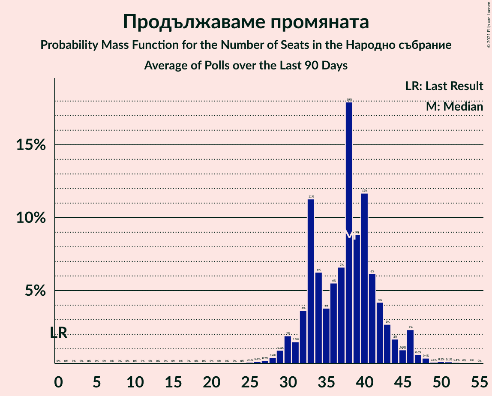

# Продължаваме промяната

<a href="#voting-intentions">Voting Intentions</a> | <a href="#seats">Seats</a>

## Voting Intentions

Last result: **0.0%** (General Election of 11 July 2021)

### Confidence Intervals

| Period     | Polling firm/Commissioner(s) | Median | 80% Confidence Interval | 90% Confidence Interval | 95% Confidence Interval | 99% Confidence Interval |
|:----------:|:----------------:|:-----------:|:-----------------------:|:-----------------------:|:-----------------------:|:-----------------------:|
| N/A | [Poll Average](average.html) | 14.2% | 11.7–16.9% | 11.1–17.6% | 10.6–18.3% | 9.6–19.5% |
| [10–17 October 2021](2021-10-17-Gallup.html) | Gallup   BNR | 13.3% | 11.6–15.4% | 11.2–16.0% | 10.7–16.5% | 10.0–17.5% |
| [5–12 October 2021](2021-10-12-SovaHarris.html) | Sova Harris   Dir.bg | 14.9% | 13.1–17.0% | 12.6–17.6% | 12.2–18.1% | 11.4–19.1% |
| [6–12 October 2021](2021-10-12-Exacta.html) | Exacta | 15.3% | 13.4–17.6% | 12.9–18.2% | 12.5–18.8% | 11.6–19.9% |
| [6–10 October 2021](2021-10-10-Центързаанализиимаркетинг.html) | Център за анализи и маркетинг | 13.4% | 12.0–15.1% | 11.6–15.5% | 11.2–16.0% | 10.6–16.8% |
| [4–10 October 2021](2021-10-10-Алфарисърч.html) | Алфа рисърч | 15.9% | 14.0–18.1% | 13.5–18.7% | 13.0–19.2% | 12.2–20.3% |
| [21–26 September 2021](2021-09-26-Gallup.html) | Gallup | 15.2% | 13.8–16.8% | 13.5–17.2% | 13.1–17.6% | 12.5–18.3% |
| [14–20 September 2021](2021-09-20-МаркетЛИНКС.html) | Маркет ЛИНКС   bTV | 11.9% | 10.4–13.7% | 9.9–14.3% | 9.6–14.7% | 8.9–15.6% |
| [8–15 September 2021](2021-09-15-Тренд.html) | Тренд | 9.1% | 7.7–10.9% | 7.3–11.4% | 7.0–11.9% | 6.4–12.8% |
| [8–15 September 2021](2021-09-15-Алфарисърч.html) | Алфа рисърч | 0.0% | N/A | N/A | N/A | N/A |
| [2–10 September 2021](2021-09-10-Gallup.html) | Gallup | 0.0% | N/A | N/A | N/A | N/A |
| [13–22 August 2021](2021-08-22-МаркетЛИНКС.html) | Маркет ЛИНКС   bTV | 0.0% | N/A | N/A | N/A | N/A |
| [23–30 July 2021](2021-07-30-Тренд.html) | Тренд   24 часа | 0.0% | N/A | N/A | N/A | N/A |
| [21–28 July 2021](2021-07-28-МаркетЛИНКС.html) | Маркет ЛИНКС   bTV | 0.0% | N/A | N/A | N/A | N/A |

### Probability Mass Function

The following table shows the probability mass function per percentage block of voting intentions for the [poll average](average.html) for Продължаваме промяната.

| Voting Intentions | Probability | Accumulated | Special Marks |
|:-----------------:|:-----------:|:-----------:|:-------------:|
| 0.0–0.5% | 0% | 100% | Last Result |
| 0.5–1.5% | 0% | 100% |  |
| 1.5–2.5% | 0% | 100% |  |
| 2.5–3.5% | 0% | 100% |  |
| 3.5–4.5% | 0% | 100% |  |
| 4.5–5.5% | 0% | 100% |  |
| 5.5–6.5% | 0% | 100% |  |
| 6.5–7.5% | 0% | 100% |  |
| 7.5–8.5% | 0% | 100% |  |
| 8.5–9.5% | 0.4% | 100% |  |
| 9.5–10.5% | 2% | 99.6% |  |
| 10.5–11.5% | 6% | 98% |  |
| 11.5–12.5% | 12% | 91% |  |
| 12.5–13.5% | 17% | 80% |  |
| 13.5–14.5% | 19% | 62% | Median |
| 14.5–15.5% | 17% | 43% |  |
| 15.5–16.5% | 13% | 26% |  |
| 16.5–17.5% | 8% | 13% |  |
| 17.5–18.5% | 4% | 5% |  |
| 18.5–19.5% | 1.3% | 2% |  |
| 19.5–20.5% | 0.4% | 0.4% |  |
| 20.5–21.5% | 0.1% | 0.1% |  |
| 21.5–22.5% | 0% | 0% |  |

## Seats

Last result: **0** seats (General Election of 11 July 2021)

### Confidence Intervals

| Period     | Polling firm/Commissioner(s) | Median | 80% Confidence Interval | 90% Confidence Interval | 95% Confidence Interval | 99% Confidence Interval |
|:----------:|:----------------:|:------:|:-----------------------:|:-----------------------:|:-----------------------:|:-----------------------:|
| N/A | [Poll Average](average.html) | 38 | 31–45 | 28–46 | 27–46 | 24–52 |
| [10–17 October 2021](2021-10-17-Gallup.html) | Gallup   BNR | 38 | 32–41 | 31–43 | 30–45 | 27–47 |
| [5–12 October 2021](2021-10-12-SovaHarris.html) | Sova Harris   Dir.bg | 38 | 33–43 | 32–45 | 31–46 | 29–49 |
| [6–12 October 2021](2021-10-12-Exacta.html) | Exacta | 38 | 36–44 | 35–46 | 33–47 | 32–52 |
| [6–10 October 2021](2021-10-10-Центързаанализиимаркетинг.html) | Център за анализи и маркетинг | 36 | 32–40 | 31–40 | 30–41 | 28–44 |
| [4–10 October 2021](2021-10-10-Алфарисърч.html) | Алфа рисърч | 44 | 40–46 | 39–46 | 35–52 | 33–55 |
| [21–26 September 2021](2021-09-26-Gallup.html) | Gallup | 41 | 39–45 | 36–46 | 35–48 | 34–50 |
| [14–20 September 2021](2021-09-20-МаркетЛИНКС.html) | Маркет ЛИНКС   bTV | 31 | 26–36 | 25–37 | 24–37 | 22–41 |
| [8–15 September 2021](2021-09-15-Тренд.html) | Тренд | 23 | 21–26 | 20–28 | 19–28 | 17–30 |
| [8–15 September 2021](2021-09-15-Алфарисърч.html) | Алфа рисърч |  |  |  |  |  |
| [2–10 September 2021](2021-09-10-Gallup.html) | Gallup |  |  |  |  |  |
| [13–22 August 2021](2021-08-22-МаркетЛИНКС.html) | Маркет ЛИНКС   bTV |  |  |  |  |  |
| [23–30 July 2021](2021-07-30-Тренд.html) | Тренд   24 часа |  |  |  |  |  |
| [21–28 July 2021](2021-07-28-МаркетЛИНКС.html) | Маркет ЛИНКС   bTV |  |  |  |  |  |

### Probability Mass Function

The following table shows the probability mass function per seat for the [poll average](average.html) for Продължаваме промяната.

| Number of Seats | Probability | Accumulated | Special Marks |
|:---------------:|:-----------:|:-----------:|:-------------:|
| 0 | 0% | 100% | Last Result |
| 1 | 0% | 100% |  |
| 2 | 0% | 100% |  |
| 3 | 0% | 100% |  |
| 4 | 0% | 100% |  |
| 5 | 0% | 100% |  |
| 6 | 0% | 100% |  |
| 7 | 0% | 100% |  |
| 8 | 0% | 100% |  |
| 9 | 0% | 100% |  |
| 10 | 0% | 100% |  |
| 11 | 0% | 100% |  |
| 12 | 0% | 100% |  |
| 13 | 0% | 100% |  |
| 14 | 0% | 100% |  |
| 15 | 0% | 100% |  |
| 16 | 0% | 100% |  |
| 17 | 0% | 100% |  |
| 18 | 0% | 100% |  |
| 19 | 0% | 100% |  |
| 20 | 0% | 100% |  |
| 21 | 0% | 100% |  |
| 22 | 0% | 99.9% |  |
| 23 | 0.1% | 99.9% |  |
| 24 | 0.3% | 99.8% |  |
| 25 | 1.1% | 99.5% |  |
| 26 | 0.6% | 98% |  |
| 27 | 1.3% | 98% |  |
| 28 | 2% | 97% |  |
| 29 | 1.1% | 95% |  |
| 30 | 2% | 94% |  |
| 31 | 5% | 91% |  |
| 32 | 5% | 86% |  |
| 33 | 6% | 82% |  |
| 34 | 5% | 76% |  |
| 35 | 4% | 71% |  |
| 36 | 5% | 67% |  |
| 37 | 7% | 62% |  |
| 38 | 11% | 55% | Median |
| 39 | 8% | 44% |  |
| 40 | 8% | 36% |  |
| 41 | 5% | 28% |  |
| 42 | 5% | 23% |  |
| 43 | 6% | 19% |  |
| 44 | 2% | 13% |  |
| 45 | 2% | 11% |  |
| 46 | 7% | 8% |  |
| 47 | 0.5% | 2% |  |
| 48 | 0.3% | 1.3% |  |
| 49 | 0.1% | 1.0% |  |
| 50 | 0.1% | 0.8% |  |
| 51 | 0.1% | 0.7% |  |
| 52 | 0.3% | 0.6% |  |
| 53 | 0.1% | 0.3% |  |
| 54 | 0.1% | 0.2% |  |
| 55 | 0% | 0.1% |  |
| 56 | 0% | 0.1% |  |
| 57 | 0% | 0% |  |

